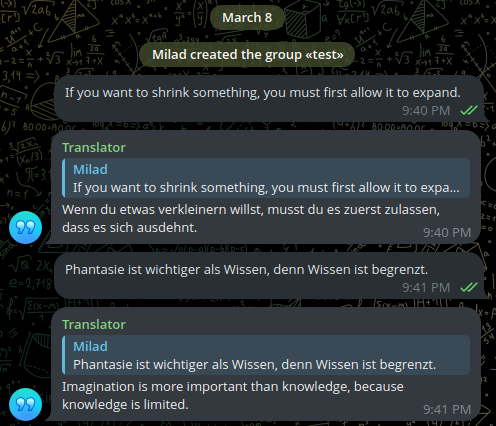

# Telegram Translator Bot

A simple Telegram bot that translates messages between two languages using Groq's LLM API.



## Prerequisites

- Python 3.12+
- A Telegram bot token
- A Groq API key

## Installation

1. Clone the repository:

   ```bash
   git clone https://github.com/miladlui/telegram-translator-bot.git
   cd telegram-translator-bot
   ```

2. Create a virtual environment and activate it:

   ```bash
   python -m venv env
   source env/bin/activate  # On Windows: env\Scripts\activate
   ```

3. Install dependencies:
   ```bash
   pip install -r requirements.txt
   ```

## Setup

1. Copy .env.example to .env:

   ```bash
   cp .env.example .env
   ```

2. Edit .env and add your keys:
   - `BOT_TOKEN`: Get from [@BotFather](https://t.me/botfather) on Telegram (create a new bot and copy the token).
   - `GROQ_API_KEY`: Sign up at [Groq](https://groq.com) and generate an API key.
   - `LLM_MODEL`: Set to your preferred Groq model (e.g., `llama3-8b-8192`).
   - `GROQ_ENDPOINT`: Leave as is.

## Usage

Run the bot:

```bash
python -m src.run
```

The bot will translate messages in group chats (ignores private chats and messages with `[no translate]`). It translates between the languages defined in config.py (e.g., English and German).
